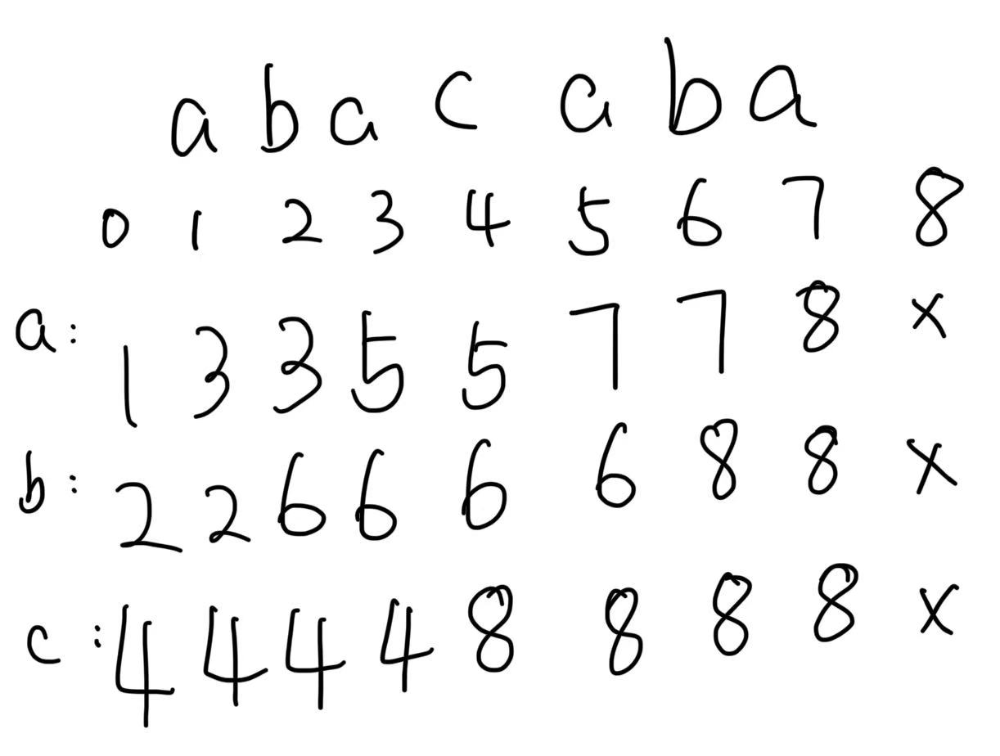

# E. Unpleasant Strings 

## 题目大意
你有一个由小写字母组成的字符串 `s`，并且这些字母都是从前 `k` 个字母里选的。我们还给定了一些查询，每个查询是一个字符串 `t`，你需要找出最少要在 `t` 后面加多少个字符，使得 `t` 不再是 `s` 的子序列。换句话说，你要使得 `t` 变成“不愉快的字符串”，即它不再是 `s` 的子序列。

## 解题思路

本题有两个比较重要的问题：

`1`: 快速判断`t`是否是`s`的子序列  --> 跳跃数组

`2`: `t`还需要几个字符不是`s`的子序列，或者说跳出`s` -->  dp

`跳跃数组`: 比如我们有一个字符串`abc`，那我们到`a`这个位置肯定就想快点知道`b`在哪里，跳跃数组就是干这个的。

```cpp
std::vector nxt(n + 2, std::vector<int>(26, n + 1));
// nxt[i][j] 表示第i个位置遇到下一个j字符最近的位置
for (int i = n - 1;i >= 0; i--) { // 从后往前遍历
  for (int j = 0;j < k; j++) {
    nxt[i][j] = (s[i + 1] == char('a' + j) ? i + 1 : nxt[i + 1][j]); 
  }
}
```


`DP`: 在我们没有办法贪心的时候就要想到DP

```cpp
std::vector<int> dp(n + 2);
// dp[i] 表示匹配到i位置还需要多少个字符才能跳出s字符串
for (int i = n; i >= 0; i--) {
  dp[i] = 1E9;
  for (int j = 0; j < k; j++) { // 加一个字符
    dp[i] = std::min(dp[i], 1 + dp[nxt[i][j]]); // 最后一位dp[n + 1]是0
  }
}
```

## AC code
```cpp
#include <bits/stdc++.h>

using ll = long long;
using ull = unsigned long long;
using i128 = __int128_t;

int main() {
  std::ios::sync_with_stdio(false);
  std::cin.tie(nullptr);

  int n, k;
  std::cin >> n >> k;

  std::string s;
  std::cin >> s;
  s = " " + s;

  std::vector nxt(n + 2, std::vector<int>(26, n + 1));
  // nxt[i][j] 表示第i个位置遇到下一个j字符最近的位置
  for (int i = n - 1;i >= 0; i--) {
    for (int j = 0;j < k; j++) {
      nxt[i][j] = (s[i + 1] == char('a' + j) ? i + 1 : nxt[i + 1][j]); 
    }
  }

  std::vector<int> dp(n + 2);
  // dp[i] 表示匹配到i位置还需要多少个字符才能跳出s字符串
  for (int i = n; i >= 0; i--) {
    dp[i] = 1E9;
    for (int j = 0; j < k; j++) { // 加一个字符
      dp[i] = std::min(dp[i], 1 + dp[nxt[i][j]]);
    }
  }

  int q;
  std::cin >> q;

  while (q--) {
    std::string t;
    std::cin >> t;
    
    int x = 0;
    for (char c: t) {
      x = nxt[x][int(c - 'a')];
    }

    std::cout << dp[x] << "\n";
  }


  return 0;
}
```


[def]: ""