## 常量与变量 📝

`let` 定义变量, 可以被多次赋值 ✏️

`const` 定义常量, 不能被二次赋值 🔒

```js
// 变量
let name = '张三';
console.log(name);
name = '李四';
console.log(name);
// 常量
const age = 18;
console.log(age);
age = 20; // 报错
```

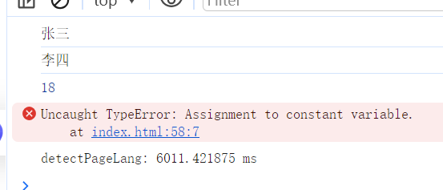

🧐 `const` 声明的数组可以添加或删除吗？ `const` 声明的对象可以添加或修改属性吗？

> 答: 可以的, 因为数组和对象在JS中属于引用类型，对其做添加、删除等操作, 并不改变其内存地址。

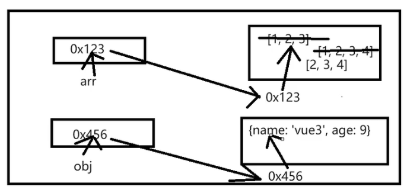

```js
const arr = [1, 2, 3];
arr.push(4);
console.log(arr);

arr = [4, 5, 6]; // 报错

const obj = {
  name: '张三',
  age: 18
}
obj.name = '李四';
console.log(obj);
```

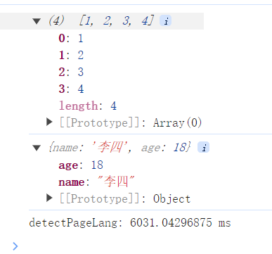

## 模板字符串 🧩

`普通字符串`：用单引号或双引号声明的

`模板字符串`：用反引号声明,``

```js
// 普通字符串
let str = 'hello world';
let str2 = "hello world";
console.log(str);
console.log(str2);
// 模板字符串
let str3 = `hello world`;
console.log(str3);
```

`模板字符串`的优势：

`1.` 任意换行

`2.` 在字符串中方便的嵌入表达式, ${表达式}

```js
let name1 = '<div><h1>hello world</h1>
  <p>hello world</p></div>'; // 报错

let name2 = `<div><h1>hello world</h1>
  <p>hello world</p></div>`; // 正常

let age = 18;
let str4 = '张三是' + (age > 18 ? '成年人' : '未成年人');
let str5 = `张三是${age > 18 ? '成年人' : '未成年人'}`;

console.log(str4);
console.log(str5);
```

## 对象 🧱

`对象` = `属性` + `方法` 的 集合

**取值**

`1.` 点

```js
obj.name
```

`2.` 中括号

```js
obj[name]
```
> Note: 当属性名是字符串的时候, 只能用中括号取值

```js
let x = 'name'
obj[x]
```

**简写**

`简写`: 当对象的属性名和属性值名字一样的时候, 可以只写一个

```js
let min = 1;
let max = 1;

const obj = {
  min,
  max
} 

console.log(obj)
```

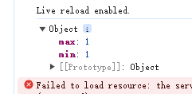

## 解构赋值 🧩

`解构赋值`: 根据一定的结构从数组或对象中快速取值

> `目标`：数组或对象 🎯

> `作用`：让数组或对象的取值更便捷 ⚡️

### 数组的解构
```js
const arr = [1,2,3,4,5,6,7,8,9,10];

// 把数组前三个元素分别赋值给 a, b, c
// 旧写法
a = arr[0];
b = arr[1];
c = arr[2];
console.log(a, b, c);

// 新写法
let [a, b, c] = arr;
console.log(a, b, c);
```

> **小练习:** 
> 
>```js
>const arr = [2, [3, 4, 5], 6]
>//把中间3, 4, 5分别赋值给 b, c, d
>let [, [b, c, d], ] = arr
>console.log(b, c, d);
>```

### 对象的解构
```js
const obj = {
  name: '张三',
  age: 18,
  gender: '男'
}

// let {age, name, gender} = obj // 这三项的顺序可以任意
// console.log(name, age, gender);

// 第一个赋值给 name，其余的赋值给 c
let {name, ...c} = obj
console.log(name, c);

// 指定，把name赋给 a
let {name: a} = obj
console.log(a);
```

> **小练习:**
>```js
>const obj = {
>  data: {
>    name: '张三',
>    age: 18,
>    gender: '男'
>  },
>  status: 200,
>  message: 'success',
>  arr: [1, 2, 3, 4, 5]
>}
>// 取出 data 中的 name, age, gender
>let {data: {name, age, gender}} = obj
>console.log(name, age, gender);
>```

## 箭头函数 ➡️

`箭头函数`: 对之前普通函数的一种简化, 写法更简洁

`有名函数`
```js
function solve(a, b) {
  return a + b
}

let a = 1
let b = 2
console.log(a + " + " + b + " = " + solve(a, b))
```

`函数表达式`
```js
let solve = function(a, b) {
  return a + b
}

let a = 1
let b = 2
console.log(a + " + " + b + " = " + solve(a, b))
```

`箭头函数`
```js
let solve = (a, b) => {
  return a + b
}

let a = 1
let b = 2
console.log(a + " + " + b + " = " + solve(a, b))
```

### 特性: ✨
`1.` 当参数只有一个时，可以忽略小括号
```js
const solve = a => {
  console.log(a)
}
```
`2.` 当函数体只有一句话时，可以忽略大括号，此时箭头函数自带 return 功能
```js
const add = (a, b) => a + b
```

`3.`直接返回一个对象
```js
const solve = () => {
  return {
    name: '张三'
  }
}
```

### 应用: 💡
既可以用于函数的声明，也可以多用于回调函数传参

```js
// 旧写法
solve(function(
  console.log(100)
), 100)

// 新写法
solve( () => {
  console.log(100)
}, 100)
```

## 数组重要方法 🧮

### 添加 ➕

  `push()` : 尾部添加

  `unshift()` : 头部添加

### 删除 ➖
   
  `pop()` : 尾部删除

  `shift()` : 头部删除

### 任意位置删除或添加 🔄

  `splice(startIndex, delCount, ...addItem)`: 

  startIndex: 起始下标

  delCount: 删除元素的个数

  addItem: 要填加的元素

### 遍历 🔍

```js
arr.forEach((item, index, array) => {
  // item: 每次遍历的对象
  // index: 当前元素在数组中的下标
  // array: 遍历的数组本身
  console.log(item, index, array)
})

let result = arr.forEach((item, index, array) => {
  // item: 每次遍历的对象
  // index: 当前元素在数组中的下标
  // array: 遍历的数组本身
  console.log(item, index, array)
})

console.log(result)
```

### 过滤 🎯
```js
const eventArr = arr.filter((item) => {
  if (item % 2 == 0) {
    return true
  } else {
    return false
  }
})
```

### 映射 🔄
```js
arr.map((item, index, array) => {
  console.log(item, index, array)
})

doubleArr = arr.map(item => item * 2)

console.log(doubleArr)

// 得到一个对象数组 (存放一堆对象的数组)
const newArr = arr.map((index, item) => {
  return {
    index,
    item
  }
})

console.log(newArr)
```

### 检测每一个 ✅

`检测每一个`: 检测数组中每一个元素是否都满足条件，如果都满足，则返回true; 否则只要发现一个不满足，就返回false

```js
const arr = [1, 2, 3, 4, 5, 6, 7, 8, 9, 10]

const flag = arr.every(item => item > 0)

console.log(flag)
```
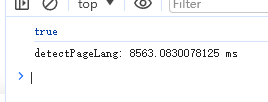

### 汇总

`汇总`: 常用于数组去和, 但不限于求和

```js
let arr = [1, 2, 3, 4, 5, 6, 7, 8, 9, 10]

arr.reduce((prev, item, index, arr) => {
  console.log(prev, item, index, arr);
}, 0)
```
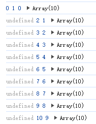

```js
let arr = [1, 2, 3, 4, 5, 6, 7, 8, 9, 10]

arr.reduce((prev, item, index, arr) => {
  console.log(prev, item, index, arr);
  return prev + item // 返回值会作为下一次的prev
}, 0)
```
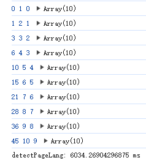

```js
let arr = [1, 2, 3, 4, 5, 6, 7, 8, 9, 10]

let result = arr.reduce((prev, item) => {
  return prev + item
}, 0)

console.log(result);
```
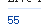

对象数组也可以这样
```js
let arr = [
  {num: 1, name: '蓝桥'}, 
  {num: 2, name: '玩具'}, 
  {num: 3, name: '书籍'}, 
]

let result = arr.reduce((prev, item) => {
  return prev + item.num
}, 0)

console.log(result);
```

## 对象重要方法

```js
const obj = {
  id: 100001,
  name: '张三',
  age: 18,
  gender: '男',
  address: '北京'
}

// 以前遍历对象
for (let key in obj) {
  console.log(key, obj[key]);
}

// 新写法
Object.keys(obj).forEach(key => {
  console.log(key, obj[key]);
})

// Object.keys(obj) 返回一个数组，数组中是对象的属性名

Object.values(obj).filter(key => key.startsWith('a')).forEach(key => {
  console.log(key, obj[key]);
})
  
```

## 扩展运算符

`作用`: 
`1.` 在解构赋值时, 用于收集余下所有的
`2.` 复制数组或对象
`3.` 合并数组或对象

```js
const arr1 = [1, 2, 3]
const arr2 = arr1
arr2.push(4)
console.log(arr1);
console.log(arr2);
```
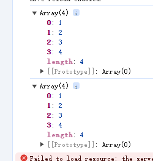

```js
const arr1 = [1, 2, 3]
const arr2 = [...arr1]
arr2.push(4)
console.log(arr1);
console.log(arr2);
```

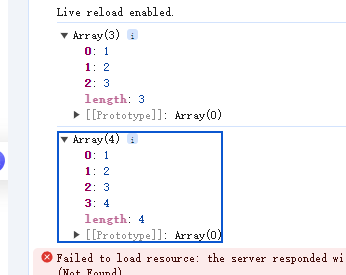

对象同理
```js
obj1 = {
  name: '李四',
  age: 20,
  gender: '女'
}

obj2 = {
  ...obj1,
}
```
合并数组或对象
```js
const arr1 = [1, 2, 3]
const arr2 = [4, 5, 6]
const arr3 = [...arr1, ...arr2]

obj1 = {
  name: '李四',
  age: 20,
  gender: '女'
}

obj2 = {
  name: '张三',
  age: 18,
  gender: '男'
}

const obj3 = {...obj1, ...obj2}
```

## 序列化和反序列化

`序列化`: 把对象转换为json格式字符串
`反序列化`: 把json格式字符串转换为对象

`json`: 是一种严格的对象表示法, 体现在json格式数据的属性名必须用双引号, 字符串必须用双引号

```js
const obj = {
  name: '张三',
  age: 18,
  gender: '男'
}

const json = {
  "name": "张三",
  "age": 18,
  "gender": "男"
}

// 序列化
const str = JSON.stringify(obj)
console.log(str);

// 反序列化
const obj2 = JSON.parse(str)
console.log(obj2);
```

## Web存储

`Web存储`: 相当于一个本地数据库, 不超过5M即可。

`sessionStorage`: 始于浏览器打开, 止于当前窗口关闭或者浏览器关闭

`localStorage`: 做到持久化存储, 只要不动手删除, 数据会永久存储

```js
// 存
localStorage.setItem('name', '张三')

// 取
// 如果存在key, 则取出相应的数据，否则取值为null(表示key不存在)
const name = localStorage.getItem('name')
console.log(name)

// 删
localStorage.removeItem('name')
```

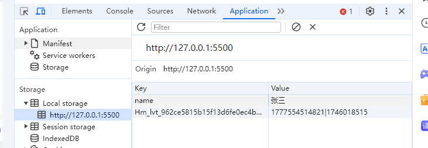

> Note: 如果要在本地存储数组或对象必须经过序列化和反序列化

```js
obj = {
  name: '张三',
  age: 18,
  gender: '男'
}

// 存, 序列化
localStorage.setItem('obj', JSON.stringify(obj))

// 取, 反序列化
const str = localStorage.getItem('obj')
const obj2 = JSON.parse(str)
console.log(obj2)~
```

## Promise + Async + Await ⚡️

`同步代码` 🔄: 串行执行, 前面的代码先执行, 后面代码后执行

`异步代码` 🔀: 并行执行

>JavaScript的代码执行既有同步也有异步，让我详细解释：
>
>1. **同步代码**：
>- 普通的代码执行都是同步的，按照顺序一行一行执行
>- 例如：
>```javascript
>let a = 1;
>let b = 2;
>console.log(a + b);
>```
>这样的代码就是同步执行，必须等前一行执行完才会执行下一行
>
>2. **异步代码**：
>特定的一些操作是异步的，主要包括：
>- 定时器（setTimeout/setInterval）
>- AJAX请求（fetch/axios）
>- 事件监听（addEventListener）
>- Promise
>- async/await
>- 文件操作
>
>举个例子来说明同步和异步的区别：
>```javascript
>console.log('1');  // 同步代码
>
>setTimeout(() => {  // 异步代码
>    console.log('2');
>}, 1000);
>
>console.log('3');  // 同步代码
>```
>执行结果会是：
>1. 先打印 "1"
>2. 再打印 "3"
>3. 1秒后才打印 "2"
>
>这是因为：
>1. JavaScript引擎会先执行所有的同步代码
>2. 遇到异步代码时，会将其放入任务队列
>3. 等所有同步代码执行完毕后，才会去执行任务队列中的异步代码
>
>所以总结来说：
>- JavaScript代码默认是同步执行的
>- 但某些特定的操作（如上面提到的那些）是异步执行的
>- 这种机制让JavaScript能够在执行耗时操作时不会阻塞主线程，保证程序的流畅运行
>
>这就是为什么JavaScript被称为"单线程异步"语言的原因。

```js
// 需求: 停两秒输出1, 再停一秒输出2, 再停一秒输出3
setTimeout(() => {
  console.log(1);
},2000)

setTimeout(() => {
  console.log(2);
},1000)

setTimeout(() => {
  console.log(3);
},1000)
```

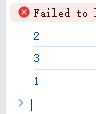

`Promise` 🤝: JS新增的一个类, 用来解决异步问题, 通过异步成功还是失败, 决定Promise的状态是成功还是失败, Promise支持链式调用, 用来消除回调地狱。

`Promise的三种状态` 🎯: 

`1.` Pending ⏳: 进行中, 此时Promise的状态还不确定

`2.` Fullfilled ✅: 成功 (状态确定了)

`3.` Rejected ❌: 失败 (状态也确定了)

> Note ℹ️: Promise的状态一旦确定了, 就不可改变了。并且状态之间的切换只能是: Pending -> Fullfilled 或 Pending -> Rejected

```js
const p = new Promise((resolve, reject) => { // 成功, 失败
  // 在这里包装异步代码: 定时器, ajax请求
  setTimeout(() => {
    // 调用 resolve() 表示成功
    resolve(1)
  },2000)
})

p.then(() => {
  console.log(1);
},() => {
  console.log(2);
})
```

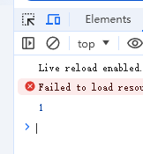

为了完成需求
```js
// 丑陋写法 👎
// 回调地狱
// 为了解决这个问题, Promise 出现了
setTimeout(() => {
  console.log(1);
  setTimeout(() => {
    console.log(2);
    setTimeout(() => {
      console.log(3);
    },1000)
  },1000)
},2000)

// 优雅写法 👍
/*
** 参数
* duration: 延迟时间
* n: 第几次
*/
function delay (duration, n) {
  return new Promise((resolve, reject) => {
    setTimeout(() => {
      resolve(n)
    },duration)
  })
}

delay(2000, 1).then(n => {
  console.log(n);
  return delay(1000, 2)
}).then(n => {
  console.log(n);
  return delay(1000, 3)
}).then(n => {
  console.log(n);
})

// 去除链式调用 ✨
function delay (duration, n) {
  return new Promise((resolve, reject) => {
    setTimeout(() => {
      resolve(n)
    },duration)
  })
}

async function log() {
  // 在 Promise 实例前 await 关键字, 这样 await 的返回值就是 Promise 实例的 resolve 的值
  // await 关键字只能出现在 async 函数中
  const n = await delay(2000, 1)
  console.log(n);
  const n2 = await delay(1000, 2)
  console.log(n2);
  const n3 = await delay(1000, 3)
  console.log(n3);
}

log()  
```

