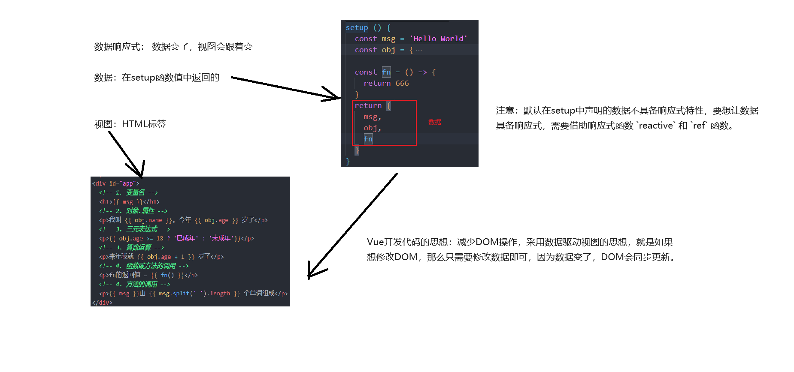
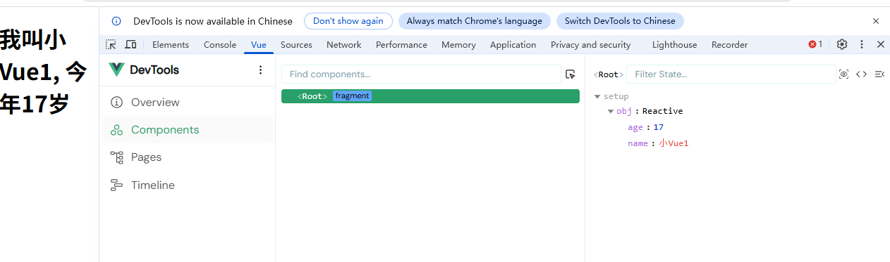
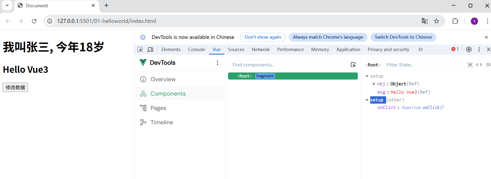
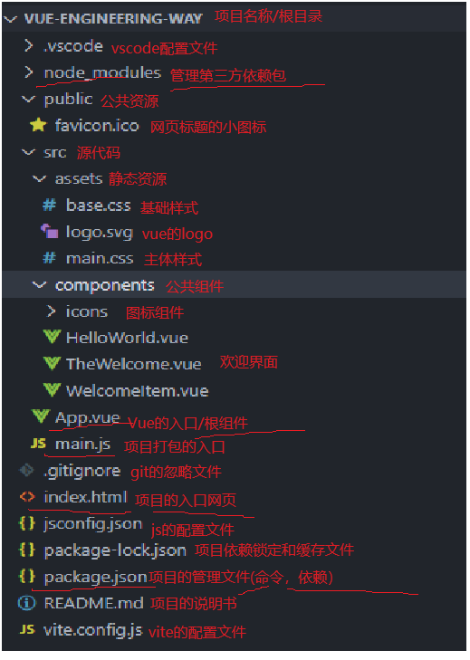
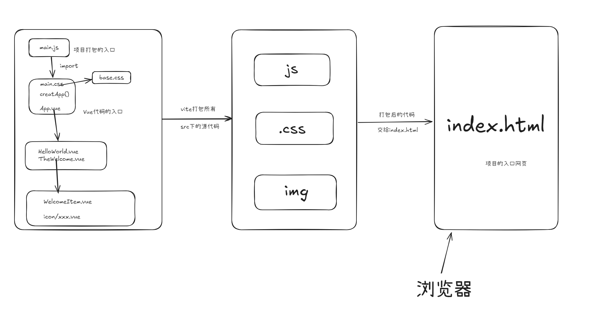
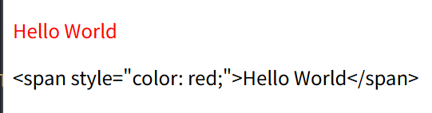
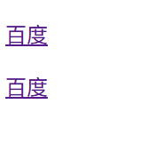
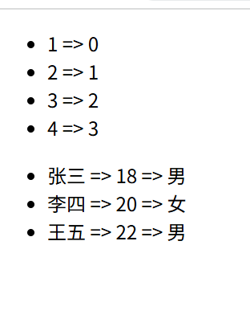
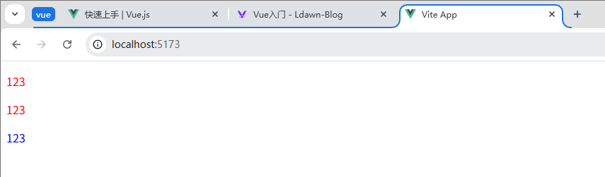
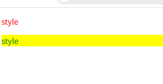

# Hello Vue3

让我们先输出一个 Hello Vue3.

```html
<!DOCTYPE html>
<html lang="en">
<head>
  <meta charset="UTF-8">
  <meta name="viewport" content="width=device-width, initial-scale=1.0">
  <title>Document</title>
</head>
<body>
  <!-- 1. 引入Vue3源代码 -->
  <script src="https://unpkg.com/vue@3/dist/vue.global.js"></script>
  <!-- 2. 准备一个容器 -->
  <div id="app">
    <!-- 4.渲染数据 -->
    {{ msg }}
  </div>
  <script>
    // 3. 创建Vue应用实例并且提供数据
    Vue.createApp({
      // 4.vue3代码的入口函数
      setup() {
        const msg = 'Hello Vue3'
        return {
          msg
        }
      }
    }).mount('#app') // 5.挂载到容器
  </script>
</body>
</html>
```
# Setup函数

`Setup函数`:

`1.` Vue3独有的, 也是vue3代码的入口/起点。

`2.` 在标签中用到的数据或函数, 需要在setup函数中声明并返回

`3.` setup中的this不只想vue实例, 并且在setup中也不会用到this

# 声明式渲染

`声明式渲染`: 又叫胡子语法、插值表达式。

`语法`: {{表达式}}

`作用`: 把表达式的结果展示/渲染到双标签中

`表达式`: 凡是有结果的操作/运算, 都属于表达式

```js
<body>
  <!-- 1. 引入Vue3源代码 -->
  <script src="https://unpkg.com/vue@3/dist/vue.global.js"></script>
  <!-- 2. 准备一个容器 -->
  <div id="app">
    <!-- 4.渲染数据 -->
    {{ msg }}
    <p>我是{{ obj.name }}, 今年{{ obj.age }}岁</p>
    <p>{{ obj.name }} 是 {{ obj.age >= 18 ? '成年人' : '未成年人' }}</p>
  </div>
  <script>
    // 3. 创建Vue应用实例并且提供数据
    Vue.createApp({
      // 4.vue3代码的入口函数
      setup() {
        const msg = 'Hello Vue3'
        const obj = {
          name: '张三',
          age: 18
        }
        return {
          msg,
          obj
        }
      }
    }).mount('#app') // 5.挂载到容器
  </script>
</body>
```

# 数据响应式



# reactive 函数

`作用`: 让一个对象具备响应式特性

`注意`: 参数只能是对象

<h3>使用:</h3>

`1.` 从 Vue 中解构处reactive函数

`2.` 给rective函数传入对象作为参数 (reactive会让这个对象变为响应式对象)

`3.` 在调试工具中进行调试

```js
<body>
  <!-- 1. 引入Vue3源代码 -->
  <script src="https://unpkg.com/vue@3/dist/vue.global.js"></script>
  <!-- 2. 准备一个容器 -->
  <div id="app">
    <!-- 4.渲染数据 -->
    <h1>我叫{{ obj.name }}, 今年{{ obj.age }}岁</h1>
  </div>
  <script>
    // 3. 创建Vue应用实例并且提供数据
    Vue.createApp({
      // 4.vue3代码的入口函数
      setup() {
        // 响应式数据
        const obj = Vue.reactive({
          name: '张三',
          age: 18
        })
        return {
          obj
        }
      }
    }).mount('#app') // 5.挂载到容器
  </script>
</body>
```



# ref 函数

`作用`: 用来定义一个响应式数据, 既可以是基本类型, 也可以是引用类型, 适用范围更广

<h3>使用:</h3>

`1.` 从Vue中解构出ref函数

`2.` 给ref函数传入指定的数据类型

```js
<body>
  <!-- 1. 引入Vue3源代码 -->
  <script src="https://unpkg.com/vue@3/dist/vue.global.js"></script>
  <!-- 2. 准备一个容器 -->
  <div id="app">
    <!-- 4.渲染数据 -->
    <h1>我叫{{ obj.name }}, 今年{{ obj.age }}岁</h1>
    <h2>{{ msg }}</h2>
    <button @click="onClick">修改数据</button>
  </div>
  <script>
    // 3. 创建Vue应用实例并且提供数据
    Vue.createApp({
      // 4.vue3代码的入口函数
      setup() {
        // 响应式数据
        const obj = Vue.ref({
          name: '张三',
          age: 18
        })
        const msg = Vue.ref('Hello Vue3')
        
        /*需要通过.value来访问响应式数据*/

        const onClick = () => {
          // 修改响应式数据
          msg.value = 'Hello World'
          obj.value.name = '李四'
          obj.value.age = 20
        }
        return {
          obj,
          msg,
          onClick
        }
      }
    }).mount('#app') // 5.挂载到容器
  </script>
</body>
```


# reactive 和 ref 的区别

`reactive`: 只接受对象作为参数, 不支持简单数据类型

`ref`: 既可以接受基本类型, 也可以接受引用类型, 但在操作的时候需要`.value`

# 包管理器及相关命令

`npm`: **装包: npm i 包名**, **删包: npm un 包名**

`pnpm`: **装包: pnpm i 包名**, **删包: pnpm un 包名**

`yarn`: **装包: yarn add 包名**, **删包: yarn remove 包名**

# 认识目录以及文件



# 三大入口文件



# 认识Vue单文件

**1.** 一个Vue单文件的`组成`: 3部分 = script(JS) + template(html) + style(CSS)

**2.** `好处`: 一个.vue文件是一个独立的模块, 就是一个独立的作用域, 无需担心变量重名

**3.** 为了避免样式冲突, 可以给 style 添加 scoped 属性

**4.** .vue 文件浏览器是识别不了的, 需要借助vite进行打包, 打包成html/css/js/图片等, 然后通过index.html访问

# 内容渲染指令

```html
<script setup>
  import { ref } from 'vue';
  const str = ref('<span style="color: red;">Hello World</span>');

</script>

<template>
  <div>
    <p v-html="str"></p>
    <p v-text="str"></p>
  </div>
</template>

<style scoped>

</style>
```



# 属性绑定指令

为了把vue表达式的值与标签的属性动态绑定, 需要借助属性绑定指令 `v-bind`。

```html
<script setup>
  import { ref } from 'vue';
  const url = ref('https://cn.bing.com/');
</script>

<template>
  <p>
    <a v-bind:href="url">百度</a>
  </p>
  <p>
    <a :href="url">百度</a>
  </p>
</template>

<style scoped>

</style>
```



# 事件绑定指令

`作用`: 与DOM元素进行事件绑定/处理

```html
<script setup>
  import { ref } from 'vue';
  const count = ref(0);
  const add = () => {
    count.value++;
  }
  const add2 = (num) => {
    count.value += num;
  }
</script>

<template>
  <div>
    <p>{{ count }}</p>
    <!-- 内联/行内代码 -->
    <button v-on:click="count++">+1</button>
    <!-- 调用无参函数 -->
    <button v-on:click="add">+1</button>
    <!-- 调用有参函数 -->
    <button v-on:click="add2(2)">+2</button>
    <!-- 简写 -->
    <button @click="count--">-1</button>
    <button @click="add2(-1)">-1</button>
  </div>
</template>

<style scoped>

</style>
```

# 条件渲染指令

`作用`: 根据vue表达式的值是true还是false, 来决定某个元素是显示还是隐藏

1. `v-show`: 是通过控制元素css的display属性控制元素显示或隐藏的
2. `v-if`: 是通过创建和插入元素或移除DOM元素控制元素显示或隐藏的

```html
<script setup>
  import { ref } from 'vue';
  const visible = ref(true);
  const islogin = ref(true);
</script>

<template>
  <div>
    <div class="red" v-show="visible"></div>
    <div class="green" v-if="visible"></div>

    <div v-if="islogin">
      <p>欢迎登录</p>
    </div>
    <div v-else-if="!islogin">
      <p>请先登录</p>
    </div>
    <div v-else>
      <p>请先登录</p>
    </div>
  </div>
</template>

<style scoped>
  .red {
    width: 100px;
    height: 100px;
    background-color: red;
  }
  .green {
    width: 100px;
    height: 100px;
    background-color: green;
  }
</style>
```

# 列表渲染指令

`作用`: 基于 数组/对象/数字 循环生产列表

```html
<script setup>
  import { ref } from 'vue';
  const nums = ref([1, 2, 3, 4]);
  const objList = ref([
    {name: '张三', age: 18, gender: '男'},
    {name: '李四', age: 20, gender: '女'},
    {name: '王五', age: 22, gender: '男'}
  ])
</script>

<template>
  <div>
    <ul>
      <li v-for="(item, index) in nums">{{ item }} => {{ index }}</li>
    </ul>
    <ul>
      <li v-for="item in objList">{{ item.name }} => {{ item.age }} => {{ item.gender }}</li>
    </ul>
  </div>
</template>

<style>

</style>
```



## v-for的key属性

`作用`: 提高 vue 在更新列表的更新性能

`语法`: :key="不重复的唯一值"

`原理`: vue内部会尽可能保持DOM的复用, 不去创建新的或更新DOM, 加了key且为id, 通过key来标明当前元素的特性是否发生变化, 如果key不变, vue直接复用之前的DOM

`类型`: 数字或字符串

`选择`: 首选id, 其次下标

# 双向绑定指令

`双向`：数据和视图
  (1) 当数据变了, 视图会变化
  (2) 当视图变了, 数据会变化
  数据 <-> 视图

`作用`:经常用在表单元素上, 比如输入框、下拉列表、单选框、复选框、文本域等。用于实现数据和标签value属性的双向绑定进而可以快速收集表单数据

```html
<script setup>
  import { reactive } from 'vue';
  const loginForm = reactive({
    username: '',
    password: '',
  })
</script>

<template>
  <div>
    账号： <input type="text" v-model="loginForm.username" /> <!--双向绑定-->
  </div>
  <div>
    密码： <input type="text" v-model="loginForm.password" />
  </div>
  <div>
    <button @click="login">登录</button> 
    <button @click="register">注册</button>
  </div>
</template>

<style>

</style>
```


# 指令修饰符

`作用`: 借助指令修饰符, 可以让指令的功能更强大

`分类`: 
  1. 按键修饰符： 用来监测用户的按键, 配合键盘事件使用。 keydown 和 keyup
  2. 事件修饰符： 简化程序对于阻止冒泡、阻止默认行为的操作
  3. 双向绑定指令修饰符: 可以让v-model的功能更强大

# 按键修饰符

```html
<script setup>
  const onkeyDown = () => {
    console.log('keydown');
  }
</script>

<template>
  <div>
    <input type="text"
          @keydown.enter="onkeyDown">
  </div>
</template>

<style>

</style>
```
# 双向绑定指令修饰符

v-model.trim="数据"： 把输入框的首尾空格去掉再同步给数据

v-model.number="数据"： 尝试被输入框的值转成数字再同步给数据

v-model.lazy="数据": 当失焦的时候再同步给数据, 而不是实时同步

```html
<script setup>
  import { reactive } from 'vue';
  const user = reactive({
    name: '',
    age: '',
  })
</script>

<template>
  <div>
    名称：<input 
            type="text" 
            v-model.trim="user.name" /> <br/> <br/>
    年龄：<input 
            type="text" 
            v-model.number="user.age" /> <br/> <br/>
  </div>
</template>

<style>

</style>
```

> v-model -> input[type=text/search] -> value
>
> v-model -> textarea -> value
> 
> v-model -> select -> value
> 
> v-model -> radio -> value
> 
> v-model -> checkbox ->
>            
>           1.只有一个复选框：v-model绑定布尔值, 关联的是复选框的checked属性
>           2.有多个复选框：v-model绑定数组, 关联的是复选框的value属性, 手动给复选框添加value属性   

```html
<script setup>
  import { ref } from 'vue';
  const intro = ref('');
</script>

<template>
  <div>
    <textarea cols="30"
              rows="10"
              v-model="intro" 
              placeholder="请输入简介">
    </textarea>
  </div>
</template>
 

<style>

</style>
```

```html
<script setup>
  import { ref } from 'vue';
  const city = ref('BJ');
  const sex = ref('A');
</script>

<template>
  <div>
    <select v-model="city">
      <option value="BJ">北京</option>
      <option value="SH">上海</option>
      <option value="GZ">广州</option>
      <option value="SZ">深圳</option> 
    </select>
    <br/>
    <br/>
    <input type="radio" v-model="sex" value="A"> A
    <input type="radio" v-model="sex" value="B"> B
    <input type="radio" v-model="sex" value="C"> C
    <br/>
    <br/>
  </div>
</template>
 

<style>

</style>
```

```html
<script setup>
  import { ref } from 'vue';
  const isAgree = ref(false);
  const hobbies = ref([]);
</script>

<template>
  <div>
    <input type="checkbox" v-model="isAgree"> 是否同意协议
  </div>
  <div>
    <input type="checkbox" v-model="hobbies" value="A"> A
    <input type="checkbox" v-model="hobbies" value="B"> B
    <input type="checkbox" v-model="hobbies" value="C"> C
    <input type="checkbox" v-model="hobbies" value="D"> D
    <input type="checkbox" v-model="hobbies" value="E"> E
    <input type="checkbox" v-model="hobbies" value="F"> F
    <input type="checkbox" v-model="hobbies" value="G"> G
    <input type="checkbox" v-model="hobbies" value="H"> H
    <input type="checkbox" v-model="hobbies" value="I"> I
    <input type="checkbox" v-model="hobbies" value="J"> J
  </div>
</template>

<style>

</style>
```
# 样式绑定

**1.** 为了便于程序员给元素动态的设置样式, Vue扩展了v-bind语法, 允许我们通过绑定class 或 style 属性, 通过数据控制元素的样式

**2.** `分类`：(1) 绑定 class (2) 绑定 style

### class 绑定
`语法`：

  1. 三元绑定：:class="条件 ? '类名1' : '类名2'"
  2. 对象绑定：:class="{类名1: 布尔值1, 类名2: 布尔值2}"

```html
<script setup>
  import { ref } from 'vue'; 
  const isActive = ref(true);
</script>

<template>
  <!-- 1.三元绑定 --->
  <p :class="isActive ? 'active' : 'inactive'">123</p>
  <!-- 2.对象绑定 -->
  <p :class="{active: isActive}">123</p>
  <!-- 3.静态class与动态class可以共存，二者会合并 -->
  <p :class="{inactive: isActive}"
    class="item">123</p>
  <!-- 两者同时存在时会优先静态的类 -->
</template>

<style>
  .active {
    color: red;
  }
  .inactive {
    color: blue;
  }
  /* .item {
    color: red;
  } */
</style>
```



### style 绑定
`语法`: :style="{CSS属性名1:表达式1, CSS属性名2:表达式2, ...}"

```html
<script setup>
  import { ref, reactive } from 'vue'
  // 字体颜色
  const colorstr = ref('red')

  const styleObj = reactive({
    color: 'green',
    background: 'yellow'
  })
</script>

<template>
  <div>
    <p :style="{color: colorstr}">style</p>
    <p :style="styleObj">style</p>
  </div>
</template>

<style>
  /* p {  类似于这种效果
    color: red;
  } */
</style>
```



